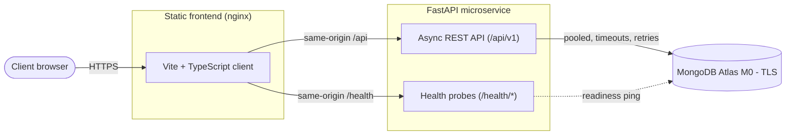

# Automated Cloud Architecture for MongoDB-Backed Microservices

Production-grade reference architecture for an asynchronous, MongoDB-backed
microservice — engineered for automation, resilience, security, and
observability, and delivered strictly within provider free tiers.


## Overview

This repository demonstrates the design and delivery of a cloud-native
microservice from first commit to production topology. It targets SOC 2 and
ISO 27001 operational hygiene and aligns with the AWS Well-Architected Framework
pillars of Operational Excellence, Security, Reliability, Performance Efficiency,
and Cost Optimization.

Delivery is modular: each layer is implemented, verified, and reviewed
independently. The application layer — an asynchronous FastAPI service and a
framework-free TypeScript client — is complete; containerization, infrastructure
as code, orchestration, CI/CD, and observability follow as discrete layers.

## Architecture



The frontend is served as optimized static assets behind a reverse proxy that
forwards `/api` and `/health` to the backend, so the browser issues only
same-origin requests and no backend host is embedded in the shipped assets. The
service persists to a multi-node MongoDB Atlas cluster over TLS with pooled
connections, explicit timeouts, and bounded retries.

## Technology

| Concern | Technology |
|---------|------------|
| API | Python 3.10+, FastAPI, Pydantic v2, PyMongo (async client) |
| Frontend | TypeScript, Vite — framework-free, zero runtime dependencies |
| Database | MongoDB Atlas (M0 free tier, TLS-only) |
| Backend quality | ruff, mypy (`--strict`), pytest |
| Frontend quality | ESLint, tsc (strict), Vitest |
| Planned | Docker, Terraform, Kubernetes, GitHub Actions, Prometheus, Grafana |

## Repository Structure

```
.
├── src/
│   ├── backend/          # Async FastAPI microservice
│   └── frontend/         # Vite + TypeScript static client
├── .github/workflows/    # CI/CD pipelines (planned)
├── terraform/            # Infrastructure as Code (planned)
├── k8s/                  # Kubernetes manifests (planned)
├── .gitattributes        # LF normalization for portable builds
└── .gitignore            # Zero-trust exclusion policy
```

## Delivery Roadmap

| Layer | Scope | Status |
|-------|-------|--------|
| 0 | Repository baseline · zero-trust ignore policy | ✅ Complete |
| 1 | Application — async FastAPI API + MongoDB persistence | ✅ Complete |
| 1 | Application — static Vite + TypeScript client | ✅ Complete |
| 2 | Containerization — multi-stage Docker, Compose | ⬜ Planned |
| 3 | Infrastructure as Code — Terraform modules | ⬜ Planned |
| 4 | Orchestration — Kubernetes probes, limits, policies | ⬜ Planned |
| 5 | CI/CD — GitHub Actions (lint, test, scan, deploy) | ⬜ Planned |
| 6 | Observability — Prometheus metrics, Grafana dashboards | ⬜ Planned |

## Getting Started

### Backend

```bash
cd src/backend
python -m venv .venv
. .venv/Scripts/activate         # Git Bash on Windows; use bin/activate on Unix
pip install -r requirements-dev.txt
cp .env.example .env             # set MONGODB_URI and MONGODB_DB_NAME
uvicorn app.main:app --reload
```

Interactive API documentation is served at `/docs` in non-production
environments. See [`src/backend/README.md`](src/backend/README.md) for details.

### Frontend

```bash
cd src/frontend
npm install
npm run dev                      # proxies /api and /health to localhost:8000
```

See [`src/frontend/README.md`](src/frontend/README.md) for details.

## Quality Gates

Every layer ships with automated verification.

| Component | Gates |
|-----------|-------|
| Backend | `ruff check` · `mypy --strict` (22 modules) · `pytest` (29 tests) |
| Frontend | `eslint` · `tsc --noEmit` (strict) · `vitest` (11 tests) · `vite build` |

The frontend production bundle is approximately 4 kB gzipped (JavaScript and CSS
combined). Both test suites are hermetic and require no database.

## Engineering Principles

- **Zero-trust secrets** — no credentials, keys, or hosts in the repository;
  configuration is injected at runtime through environment variables.
- **Minimal attack surface** — a framework-free frontend and a distroless image
  target keep dependencies and exposure low.
- **Resilience** — bounded retries, explicit timeouts, and readiness gating so a
  transient database outage degrades gracefully instead of crashing.
- **Observability** — structured JSON logs with per-request correlation
  identifiers, ready for aggregation.
- **12-factor configuration** — strictly separated config, validated at startup.
- **Zero cost** — every component fits provider free tiers and open-source tools.

## License

Released under the [MIT License](LICENSE).
